<div align="center">

# AlgoViz: Interactive Algorithm Visualizer

### *See algorithms think.*

**27 classic algorithms** across sorting, searching, geometry, math — **and quantum computing** —
running one step at a time, with synced pseudocode, live operation counters and a plain-English
explanation of every single move. Built for newcomers, the curious, and anyone who learns by watching.


<br/><br/>

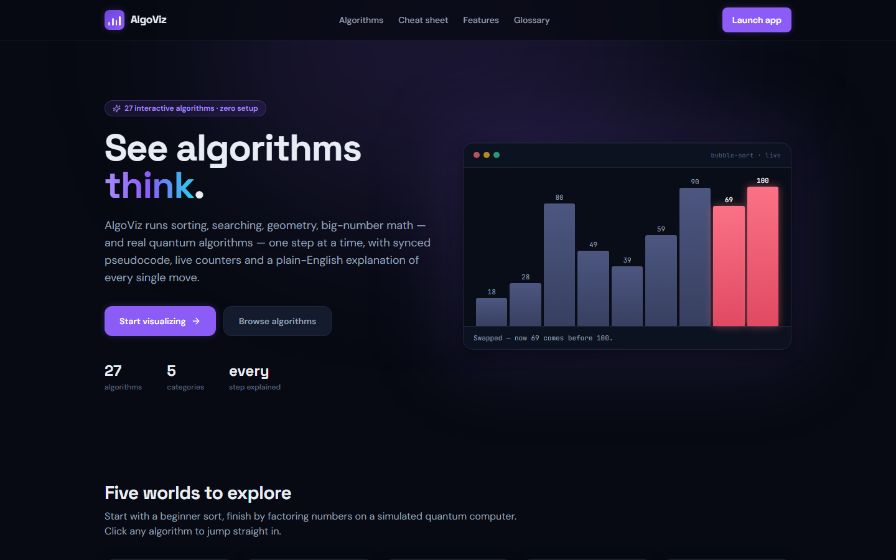

</div>

---

## Why AlgoViz?

Most visualizers show you *that* an algorithm works. AlgoViz is built around the moment it **clicks**:

- **Every step narrates itself** — *“17 > 9, so they must swap”*, *“discard everything left of the middle”*.
- **The pseudocode line being executed lights up** in sync with the animation, connecting picture to code.
- **Live counters** (comparisons, swaps, distance calculations) turn Big-O from a formula into numbers you watch grow.
- **You control the clock** — play, pause, single-step, scrub the timeline, 1–25 steps per second.
- **Bring your own data** — type a custom array, click points onto the plane, or pick worst-case presets (reversed, nearly-sorted, few-unique) and watch the trade-offs change.

## The visualizers

| Sorting — colour-coded bars | Searching — pointers & shrinking windows |
| :---: | :---: |
| 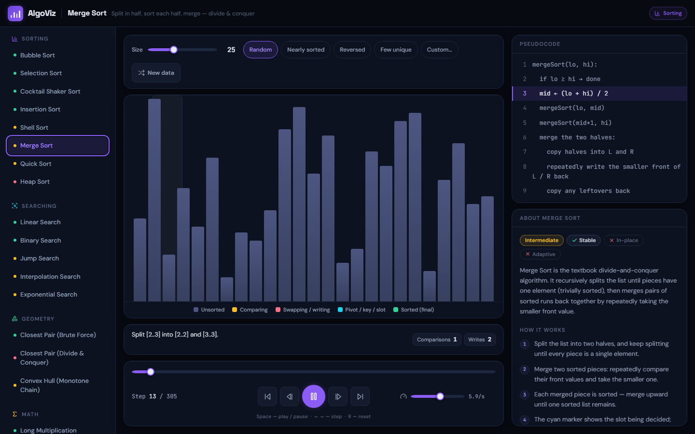 | 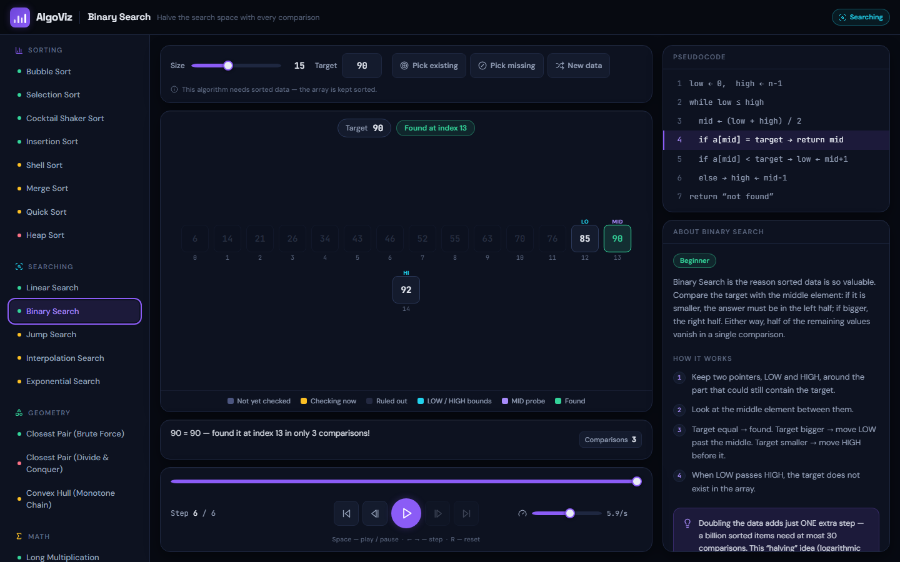 |

| Geometry — divide & conquer on the plane | Math — live recursion trees |
| :---: | :---: |
| 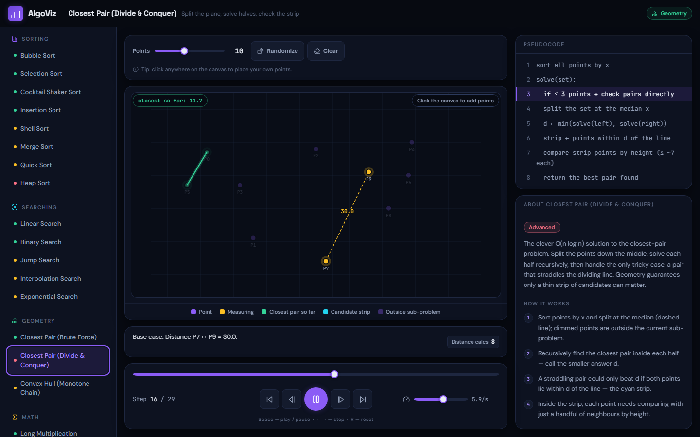 | 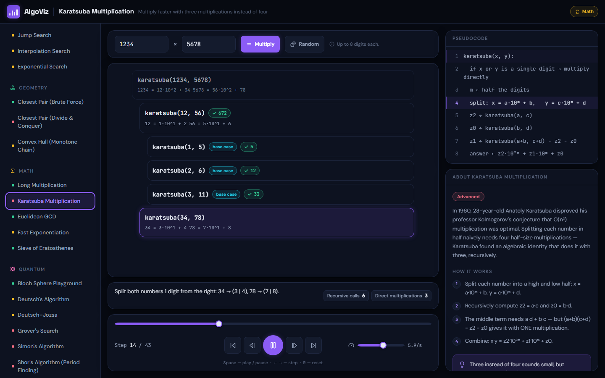 |

| Quantum — the Bloch sphere, gate by gate | Quantum — Grover amplifying the needle |
| :---: | :---: |
| 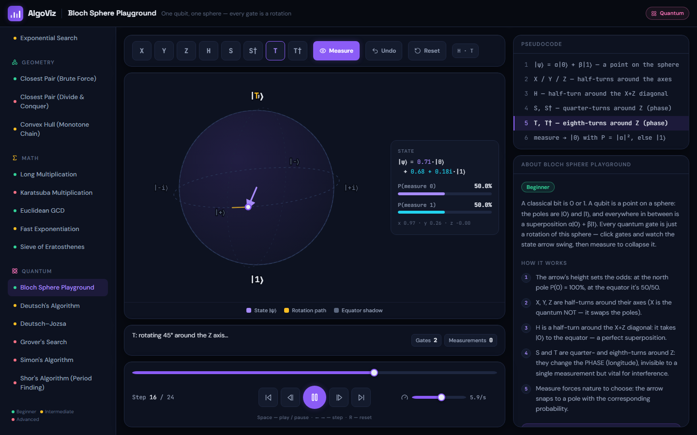 | 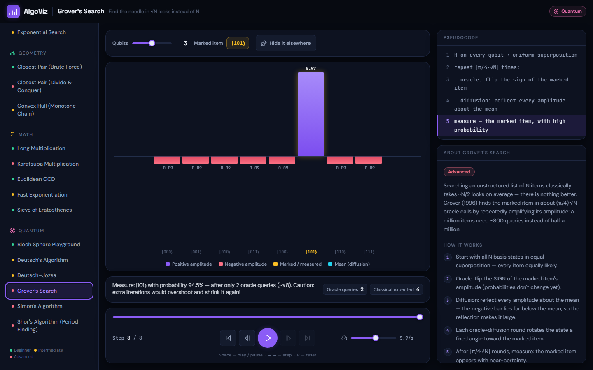 |

| Primes — the sieve crosses out composites | Fully responsive — phone to desktop |
| :---: | :---: |
| 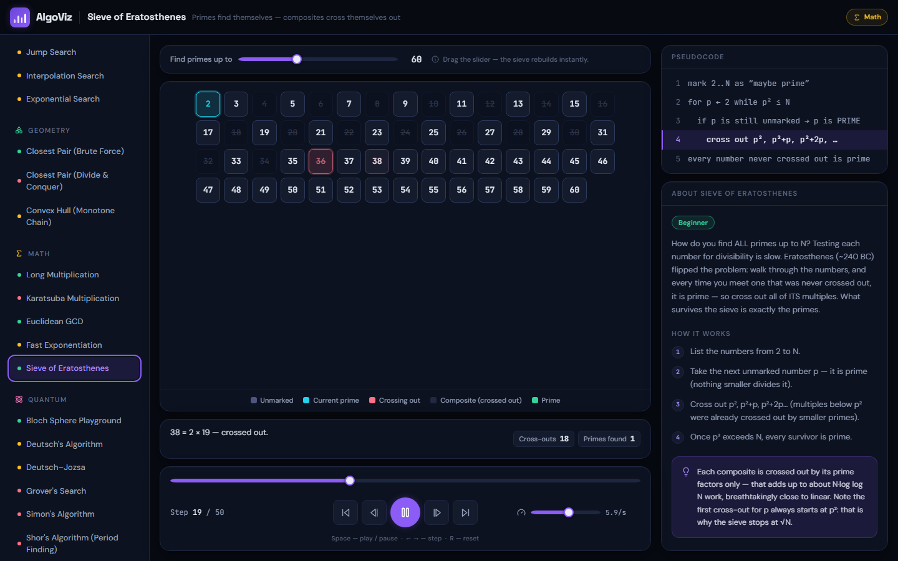 | 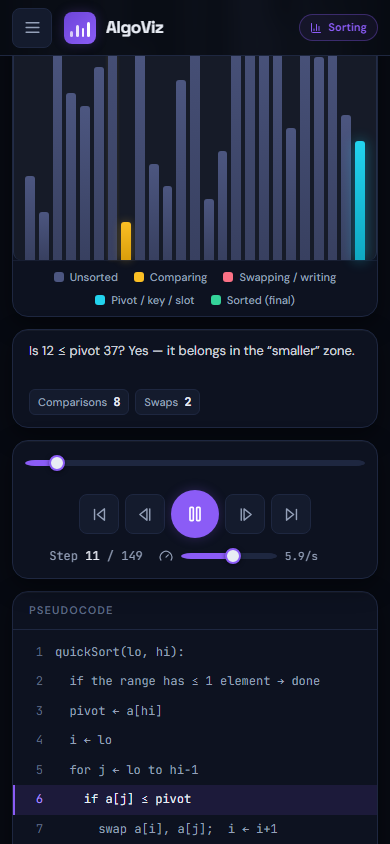 |

### Shor's algorithm, honestly simulated

The QFT spectrum below is computed exactly — those peaks at multiples of Q/r are the hidden
period of aˣ mod N becoming readable, the step that breaks RSA on a real quantum computer.

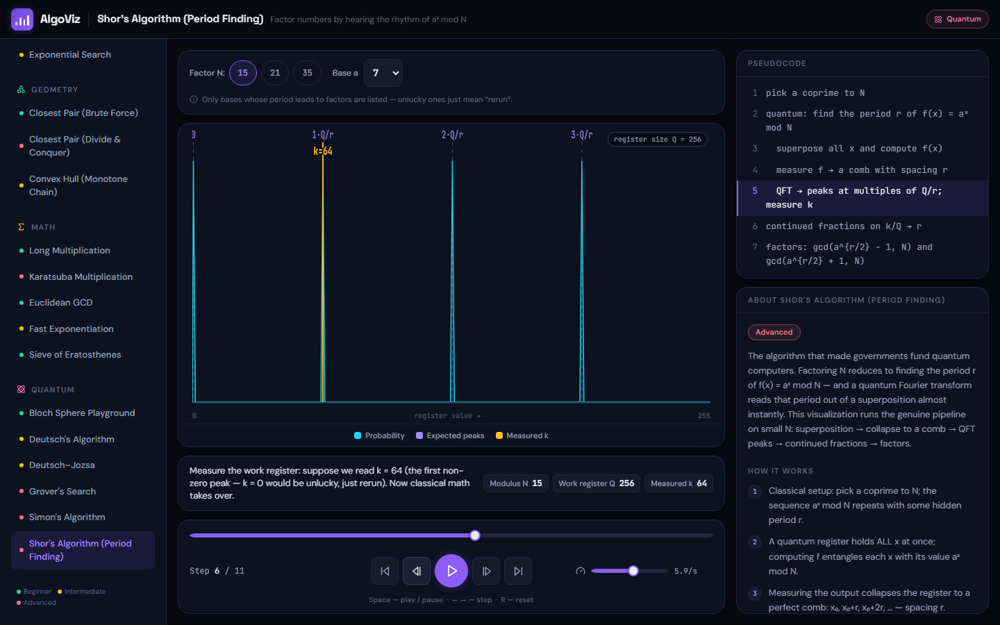

### Big-O cheat sheet, built in

The landing page doubles as a learning resource: a colour-coded complexity table of all 21
algorithms (click any row to watch it live) and a plain-English glossary of the eight terms
that unlock every algorithms textbook.

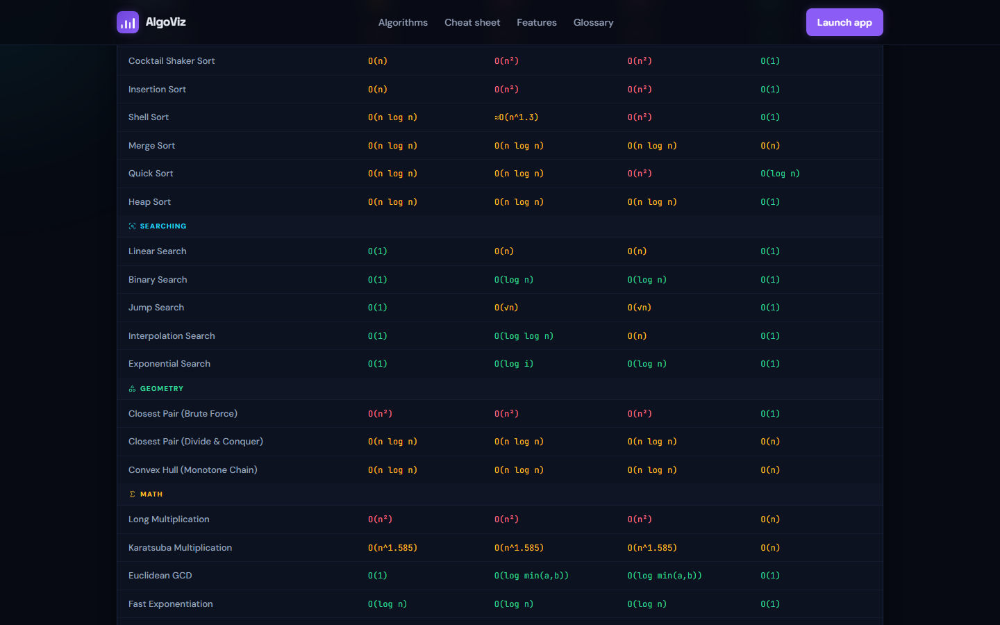

## All 27 algorithms

### Sorting
| Algorithm | Difficulty | Average | Space | In one line |
|---|---|---|---|---|
| Bubble Sort | Beginner | O(n²) | O(1) | Swap out-of-order neighbours until nothing moves |
| Selection Sort | Beginner | O(n²) | O(1) | Find the minimum, put it in front, repeat |
| Cocktail Shaker Sort | Beginner | O(n²) | O(1) | Bubble Sort that sweeps in both directions |
| Insertion Sort | Beginner | O(n²) | O(1) | Slide each new value into the sorted part — like cards |
| Shell Sort | Intermediate | ≈O(n^1.3) | O(1) | Insertion Sort over shrinking gaps |
| Merge Sort | Intermediate | O(n log n) | O(n) | Split in half, sort each half, merge |
| Quick Sort | Intermediate | O(n log n) | O(log n) | Partition around a pivot, then conquer each side |
| Heap Sort | Advanced | O(n log n) | O(1) | Build a max-heap, repeatedly extract the largest |

### Searching
| Algorithm | Difficulty | Average | In one line |
|---|---|---|---|
| Linear Search | Beginner | O(n) | Check every element, one by one |
| Binary Search | Beginner | O(log n) | Halve the search space with every comparison |
| Jump Search | Intermediate | O(√n) | Hop in √n blocks, then scan one block |
| Interpolation Search | Intermediate | O(log log n) | Estimate where the value *should* be — like a phone book |
| Exponential Search | Intermediate | O(log i) | Double ahead to find the window, then binary search it |

### Geometry
| Algorithm | Difficulty | Average | In one line |
|---|---|---|---|
| Closest Pair (Brute Force) | Beginner | O(n²) | Measure every possible pair of points |
| Closest Pair (Divide & Conquer) | Advanced | O(n log n) | Split the plane, solve halves, check the strip |
| Convex Hull (Monotone Chain) | Intermediate | O(n log n) | Wrap a rubber band around all the points |

### Math
| Algorithm | Difficulty | Average | In one line |
|---|---|---|---|
| Long Multiplication | Beginner | O(n²) | The schoolbook method, digit by digit |
| Karatsuba Multiplication | Advanced | O(n^1.585) | Three half-size multiplications instead of four |
| Euclidean GCD | Beginner | O(log min(a,b)) | The oldest algorithm still in daily use (~300 BC) |
| Fast Exponentiation | Intermediate | O(log n) | xⁿ in log n steps by squaring |
| Sieve of Eratosthenes | Beginner | O(n log log n) | Primes find themselves — composites cross themselves out |

### Quantum
| Algorithm | Difficulty | Cost | In one line |
|---|---|---|---|
| Bloch Sphere Playground | Beginner | O(1) per gate | One qubit, one sphere — every gate is a rotation |
| Deutsch's Algorithm | Intermediate | 1 query | Ask one question, learn about two answers |
| Deutsch–Jozsa | Intermediate | 1 query | One query beats 2ⁿ⁻¹+1 — the first exponential gap |
| Grover's Search | Advanced | O(√N) queries | Find the needle in √N looks instead of N |
| Simon's Algorithm | Advanced | O(n) queries | Uncover a hidden XOR mask with a handful of runs |
| Shor's (Period Finding) | Advanced | O((log N)³) | Factor numbers by hearing the rhythm of aˣ mod N |

The quantum visualizers are **exact state-vector simulations** — signed amplitude bars you can
watch interfere, a clickable Bloch sphere, and Shor's genuine QFT spectrum. No cartoons: the
verification harness checks Grover's final probability against the closed-form
sin²((2t+1)·θ) to nine decimal places.

Every algorithm ships with a beginner-friendly **About**, a numbered **How it works**, a key
**insight** callout, **Stable / In-place / Adaptive** badges (for sorts), complexity tiles and
**real-world uses** — so the visualization always comes with the *why*.

## Quick start

```bash
cd algorithm-visualizer
npm install
npm run dev       # → http://localhost:5173
```

| Script | What it does |
|---|---|
| `npm run dev` | Vite dev server with HMR |
| `npm run build` | Production build |
| `npm run verify` | Correctness harness — every generator vs. randomized inputs (340k+ assertions) |
| `npm run lint` | ESLint |

**Keyboard shortcuts:** `Space` play/pause · `←` `→` step · `R` reset.

## Correctness, verified

Animations that lie are worse than no animations. `npm run verify` replays every step
generator against hundreds of randomized inputs — including the nasty ones (single elements,
duplicates, reversed runs, absent targets, zero operands, collinear points) — and asserts the
final state against reference implementations: sorted permutations, `indexOf`, brute-force
closest pair, a reference hull, native `BigInt` math, a reference sieve — and quantum theory
itself: hand-computed Bloch states, exact 0/1 Deutsch–Jozsa probabilities, Grover's closed-form
success rate, Simon's GF(2) system, and Shor's factors for every offered (N, a).

## Architecture

Every algorithm is a **pure step generator**: it returns an array of frames — full snapshots
with highlights, narration, the active pseudocode line and cumulative stats — and a single
playback engine drives any of them. Adding algorithm #22 means writing one generator plus
metadata in `src/algorithms/`; the playback bar, code panel, stats and explainers come free.

```
algorithm-visualizer/src/
├── algorithms/            # step generators + metadata (the registry)
│   ├── sorting.js         #   8 sorts
│   ├── searching.js       #   5 searches
│   ├── geometry.js        #   closest pair ×2, convex hull
│   ├── maths.js           #   multiplication ×2, GCD, fast power, sieve
│   ├── quantum.js         #   Bloch, Deutsch, Deutsch–Jozsa, Grover, Simon, Shor
│   └── index.js           #   categories + lookup
├── lib/quantum.js         # exact quantum math: rotations, Walsh–Hadamard, QFT spectra
├── hooks/usePlayback.js   # the playback engine + keyboard shortcuts
├── components/
│   ├── visualizers/       # Sorting · Search · Geometry · Math · Sieve · Bloch · Quantum
│   ├── controls/          # PlaybackBar, DataControls (incl. quantum gate palette)
│   ├── panels/            # CodePanel, InfoPanel, StatusStrip
│   └── layout/            # Header, Sidebar
└── pages/                 # LandingPage, VisualizerPage
```

## Author

**Sunny Shaban Ali** — born as a Design & Analysis of Algorithms course project (Fall 2024),
rebuilt from the ground up as a learning tool.
